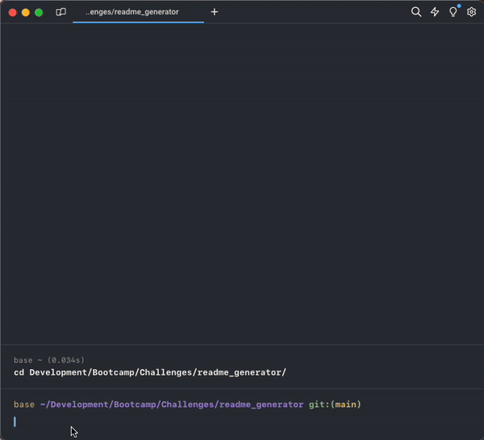

# CLI README Generator

This is a command-line application that generates a high-quality, professional README.md file for your project repository. The generated README includes sections such as Description, Table of Contents, Installation, Usage, License, Contributing, Tests, and Questions.

## Table of Contents
- [App Demo](#-app-demo)
- [Usage Information](#-usage-information)
- [Installation](#-installation)
- [Contribution Guidelines](#-contribution-guidelines)
- [Testing Instructions](#-testing-instructions)
- [Questions](#questions)
- [License](#license)

## App Demo

## Installation
Clone the repository to your local machine:

`cd` to your local `/readme_generator` directory and run:
>`git clone https://github.com/alexanderjgael/readme_generator`

>`npm i inquirer`

## Usage Information
To use the application, follow these steps:

1. Clone the respository to your local machine.
2. Naviagte to the root directory of the project.
3. Run the application by executing the command `node index.js` or `node .`
4. Follow the prompts to enter the information about your project.

## Contribution Guidelines
Contributions are welcome! If you would like to contribute to this project, please fork the repository and submit a pull request.

## Questions
For any additional questions, feel free to [reach out via email](${data.email}) or visit [my GitHub profile](https://github.com/${data.github})

## License
Full license information can be found [here](https://opensource.org/license/mit)
